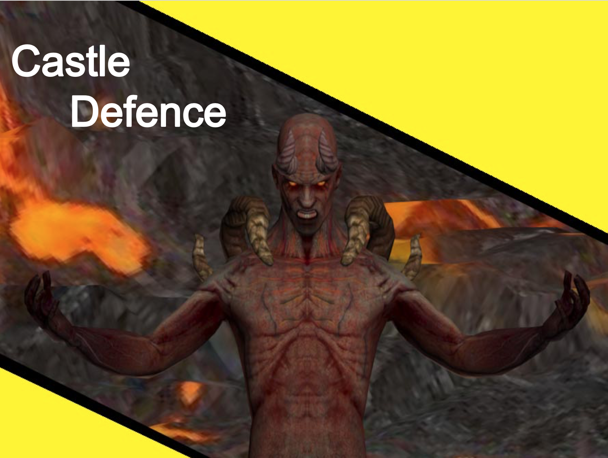
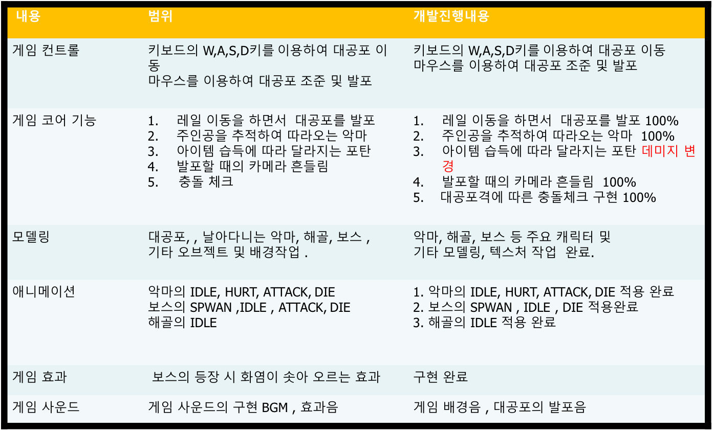
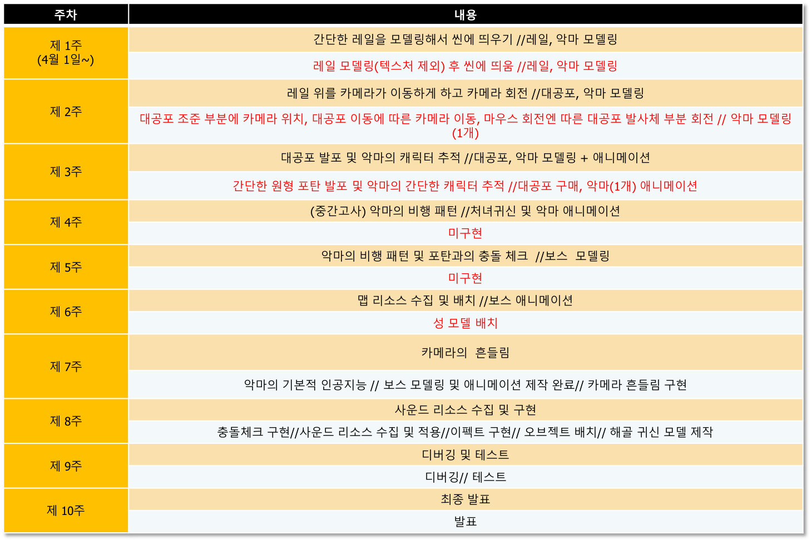

# CastleDefence

> 10주간 C, C++, Ogre3d engine으로 만든 프로젝트입니다.

[](license.txt)



## 프로젝트 설명

2015 - Game engine 수업에서 진행했던 10주 프로젝트입니다. Ogre3d 엔진을 이용해서 개발했으며 개발자 2명, 디자이너 1명이 개발했습니다.
게임 컨셉은 기존 디펜스 게임에서의 다양한 미션과 대공포를 이용한 기지 방어모드를 일부 차용했습니다.
<br><br>

## 게임 설명
- 게임 요약: "성을 공격하는 악마를 막아라!". <br> 1인칭 시점의 FPS 게임이며 대공포를 이용해 날아 들어오는 악마로부터 성을 지키는 게임입니다.

- 게임 장르 : 디펜스 게임.

- 게임 방식 : 방향키를 이용해 대공포를 조작하며 마우스를 누르면 대공포가 발사됩니다. 

- 게임 목표 : 악마를 처치하고 최종보스를 처치하면 승리하게 됩니다.

## 구현 내용

### 구조
- GameManager Class를 최상위 클래스로 만들어 GameState를 관리함으로써 게임 시작-진행-종료를 Scene처럼 개발 할 수 있게 했으며, GameState Class는 가상화를 통해 각 게임상태별로 구현할 수 있도록 개발했습니다. <br>
- 나머지 각각 총알, 악마, 플레이어, 보스 등은 객체로 만들어 각 State에서 객체로 불러와 생성 및 소멸을 하게 했습니다. Ogre3d Game Engine를 통해 게임의 그래픽, 사운드를 구현할 수 있었습니다.

```sh
#pragma once

#include "GameManager.h"

class GameState
{
    public:
    virtual void enter(void) = 0;
    virtual void exit(void) = 0;

    virtual void pause(void) = 0;
    virtual void resume(void) = 0;

    virtual bool frameStarted(GameManager* game, const Ogre::FrameEvent& evt) = 0;
    virtual bool frameEnded(GameManager* game, const Ogre::FrameEvent& evt) = 0;

    virtual bool mouseMoved(GameManager* game, const OIS::MouseEvent &e) = 0;
    virtual bool mousePressed(GameManager* game, const OIS::MouseEvent &e, OIS::MouseButtonID id ) = 0;
    virtual bool mouseReleased(GameManager* game, const OIS::MouseEvent &e, OIS::MouseButtonID id ) = 0;

    virtual bool keyPressed(GameManager* game, const OIS::KeyEvent &e) = 0;
    virtual bool keyReleased(GameManager* game, const OIS::KeyEvent &e) = 0;

    void changeState(GameManager* game, GameState* state)
    {
        game->changeState(state);
    }
};
```

```sh
class GameManager :  
    public Ogre::FrameListener,
    public OIS::KeyListener, 
    public OIS::MouseListener
{
public:
    GameManager();
    ~GameManager();

    void init(void);
    void changeState(GameState* state);
    void pushState(GameState* state);
    void popState();

    void go(void);

    bool mouseMoved( const OIS::MouseEvent &e );
    bool mousePressed( const OIS::MouseEvent &e, OIS::MouseButtonID id );
    bool mouseReleased( const OIS::MouseEvent &e, OIS::MouseButtonID id );

    bool keyPressed( const OIS::KeyEvent &e );
    bool keyReleased( const OIS::KeyEvent &e );


protected:
    Ogre::Root* mRoot;
    Ogre::RenderWindow* mWindow;

    OIS::Keyboard* mKeyboard;
    OIS::Mouse* mMouse;
    OIS::InputManager *mInputManager;

    bool frameStarted(const Ogre::FrameEvent& evt);
    bool frameEnded(const Ogre::FrameEvent& evt);

private:
    std::vector<GameState*> states;

    Ogre::SceneManager* mSceneMgr;
    Ogre::Camera* mCamera;
    Ogre::Viewport* mViewport;
};
```


### 구현요소 (구현율)



### 개발 일정



## 실행 방법


1. [git clone](https://github.com/jangseongwoo/2dGame-C-SDL.git) 을 하세요.
```sh
git clone https://github.com/jangseongwoo/castleDefence.git
```

2. Visual studio의 프로젝트 열기로  castleDefence  _source_ 폴더를 열어주세요.

3. Visual studio로 프로젝트를 컴파일 및 빌드 해주시면 실행됩니다.

## 개발 환경

- 사용 OS : 윈도우7 64bit
- 개발 툴 : Visual Studio 2014

## 사용 기술

- C, C++, Ogre3d, Git

## 정보

프로젝트에 대한 더 자세한 정보를 원하신다면,  castleDefence 폴더 내에 있는 _final_report.pptx_ 를 참조해주세요.

장성우 – [@facebook](https://www.facebook.com/profile.php?id=100007028118707&ref=bookmarks) – seongwoo.dev@gmail.com

MIT 라이센스를 준수하며 ``LICENSE``에서 자세한 정보를 확인할 수 있습니다.

[https://github.com/jangseongwoo/github-link](https://github.com/jangseongwoo/github-link)

<!-- Markdown link & img dfn's -->
[npm-image]: https://img.shields.io/npm/v/datadog-metrics.svg?style=flat-square
[npm-url]: https://npmjs.org/package/datadog-metrics
[npm-downloads]: https://img.shields.io/npm/dm/datadog-metrics.svg?style=flat-square
[travis-image]: https://img.shields.io/travis/dbader/node-datadog-metrics/master.svg?style=flat-square
[travis-url]: https://travis-ci.org/dbader/node-datadog-metrics
[wiki]: https://github.com/yourname/yourproject/wiki
